# M7ZM Social Media Platform

Welcome to the M7ZM Social Media Platform! This project is a private social media website created for the M7ZM clan. It allows users to upload and share videos and images, rate and comment on them, and chat with other users. Access to the platform is restricted, and only approved users can log in.

## Table of Contents

- [About This Project](#about-this-project)
- [Demo Video](#demo)
- [Features](#features)
- [Key Details](#key-details)
- [Installation](#installation)
- [Usage](#usage)
- [File Structure](#file-structure)
- [Database](#database)
- [Screenshots](#screenshots)
- [Conclusion](#conclusion)

## About This Project

The M7ZM Social Media Platform is designed to be a private social space for the M7ZM clan. This project was created by leveraging HTML, CSS, JavaScript, and PHP, along with MySQL for the database. The primary purpose of this platform is to allow members of the M7ZM clan to share and enjoy gaming-related content in a secure, private environment.

## Demo

Check out the demo of the project on YouTube: [Demo Video](https://www.youtube.com/your-demo-video-link)

### Key Details

- **Restricted Access:** New users must be manually approved by changing their accessibility status in the database from 0 to 1.
- **Content Sharing:** Users can upload videos and images related to their gaming experiences. These can be viewed, rated, and commented on by other members.
- **Favorites:** Members can add videos and images to their favorites for easy access.
- **User Interaction:** The platform supports real-time chat between users, enhancing community interaction.
- **Account Management:** Users have control over their profiles and can update their bio, profile picture, and other personal information.
- **Password Reset:** A restore key mechanism allows users to reset their passwords securely.
- **Overwatch Custom Games:** Retrieve and share Overwatch custom game codes.
- **Call of Duty Games:** View and filter Call of Duty game release dates.
- **Game Ratings and Reviews:** Users can rate games and submit reviews. Other users can read these reviews, and each game has an average rating.
- **Public Features:** Users who are not logged in can view public videos and use a translator that translates between English and "انجليزي معرب" (e.g., "Mr7ba" = "مرحبا").

This project was developed to provide a fun and engaging way for the M7ZM clan members to connect, share, and interact within their private community.

## Features

- **User Authentication:** Secure login and registration system.
- **Access Control:** Only users with accessibility status set to 1 in the database can log in.
- **Video and Image Uploads:** Users can upload and share videos and images.
- **Rating and Commenting:** Users can rate and comment on videos and images.
- **Favorites:** Users can add videos and images to their favorites.
- **Profile Management:** Users can manage their profiles, including updating their bio and profile image.
- **Chat:** Real-time chat functionality between users.
- **Password Reset:** Users can reset their passwords using a restore key.
- **Overwatch Custom Games:** Retrieve and share Overwatch custom game codes.
- **Call of Duty Games:** View and filter Call of Duty game release dates.
- **Game Ratings and Reviews:** Users can rate games, submit reviews, and read reviews with average ratings.
- **Public Features:** Non-logged-in users can view public videos and use a unique translator.

## Installation

1. **Clone the repository:**

   ```bash
   git clone https://github.com/your-username/m7zm-social-platform.git
   cd m7zm-social-platform
   ```

2. **Set up the database:**

   - Create a MySQL database and import the `m7zm_Social_db.sql` file.
   - Update the `config.php` file with your database credentials.

3. **Configure your web server:**
   - Ensure your web server is set up to serve the files in the repository.

## Usage

1. **Register a new account:**

   - Visit the registration page and create a new account.

2. **Log in:**

   - Log in with the new account. Note that the initial accessibility status is set to 0.

3. **Approve new users:**

   - Manually change the accessibility status to 1 in the database to enable login for the new account.

4. **Explore the platform:**
   - Upload videos and images, rate and comment on content, and chat with other users.

## File Structure

```plaintext
├── index.html
├── m7zm_Social_db.sql
├── assets
│   ├── images
│   ├── json
│   ├── animations
│   └── ...
├── screenshots
├── backend
│   ├── auth_check.php
│   ├── config.php
│   ├── delete_video.php
│   ├── fetch_custom_games.php
│   ├── fetch_favorites.php
│   ├── fetch_games.php
│   ├── fetch_images.php
│   ├── fetch_messages.php
│   ├── fetch_ow_tags.php
│   ├── fetch_private_public_videos.php
│   ├── fetch_public_videos.php
│   ├── fetch_reviews.php
│   ├── fetch_tags.php
│   ├── fetch_users.php
│   ├── fetch_user_profile.php
│   ├── fetch_user_videos.php
│   ├── functions.php
│   ├── get_member_since.php
│   ├── get_user_id.php
│   ├── get_user_info.php
│   ├── get_video_details.php
│   ├── handle_favorite.php
│   ├── handle_like.php
│   ├── login.php
│   ├── logout.php
│   ├── my_videos.php
│   ├── register.php
│   ├── reset_password.php
│   ├── search_videos.php
│   ├── send_message.php
│   ├── submit_review.php
│   ├── update_status.php
│   ├── update_user.php
│   ├── update_video.php
│   ├── upload_image.php
│   ├── upload_video.php
│   ├── user_account.php
│   ├── video_details.php
├── css
│   ├── cod.css
│   ├── customGames.css
│   ├── edit_profile.css
│   ├── gallery.css
│   ├── games.css
│   ├── GlobalStyles.css
│   ├── home.css
│   ├── login.css
│   ├── my_account.css
│   ├── my_favorites.css
│   ├── register.css
│   ├── resetpass.css
│   ├── search_user.css
│   ├── style.css
│   ├── trjmh.css
│   ├── upload_image.css
│   ├── upload_video.css
│   ├── user_account.css
│   ├── user_chat.css
│   ├── video_details.css
│   └── watch_videos.css
├── js
│   ├── home.js
│   ├── login.js
│   ├── my_videos.js
│   ├── profile.js
│   ├── resetPassword.js
│   └── video_details.js
├── lib
│   └── getID3
├── pages
│   ├── cod.php
│   ├── customGames.php
│   ├── edit_profile.php
│   ├── gallery.php
│   ├── games.php
│   ├── home.php
│   ├── login.php
│   ├── my_account.php
│   ├── my_favorites.php
│   ├── navbar.php
│   ├── register.php
│   ├── reset_password.php
│   ├── search_user.php
│   ├── trjmh.php
│   ├── upload_image.php
│   ├── upload_video.php
│   ├── user_account.php
│   ├── user_chat.php
│   ├── video_details.php
│   └── watch_videos.php
└── storage
    ├── images
    ├── profile_images
    ├── videos
    └── video_thumbnails
```

## Database

- The main database file is `m7zm_Social_db.sql`.
- User accessibility is controlled by the `accessibility` field in the `users` table. Set this field to 1 for users who are allowed to log in.
- The `restore_key` is stored in the `restorekeys` table and is used for password reset functionality.

## screenshots

#### Welcome Page :

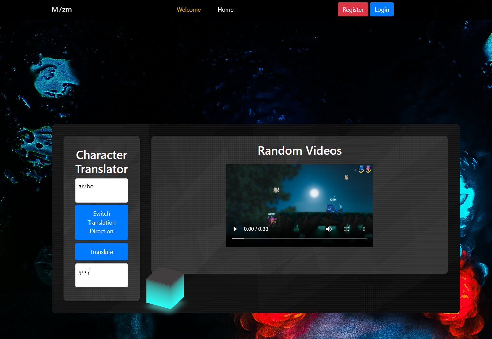

#### Welcome Page :

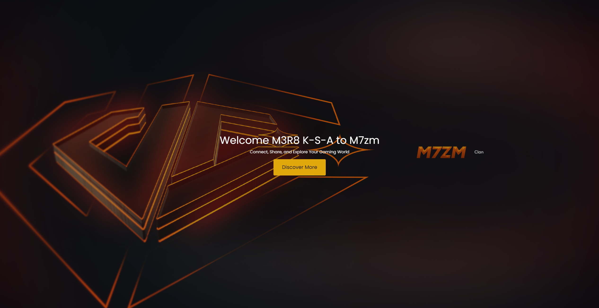

#### Home Page :

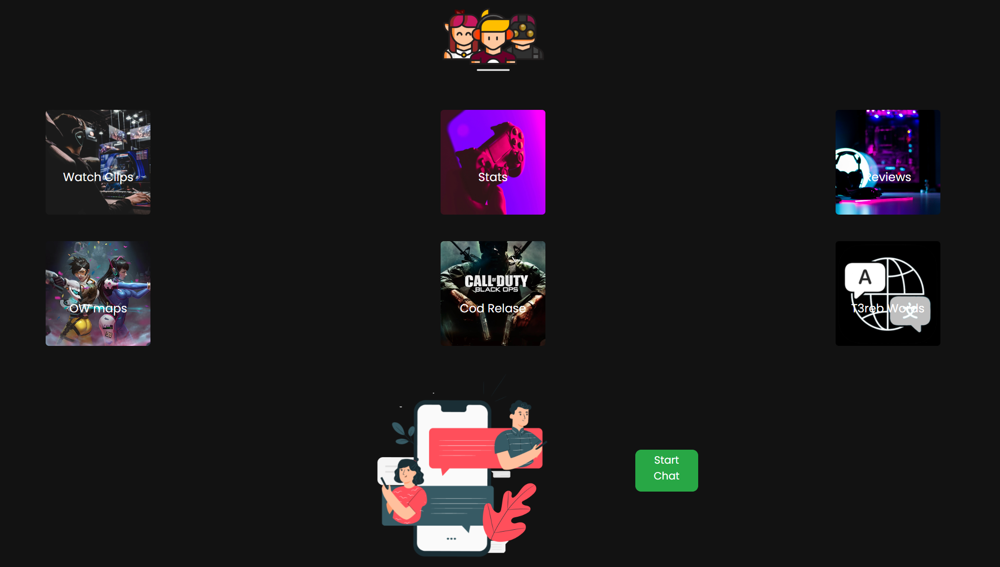

#### Watch Clips Page :

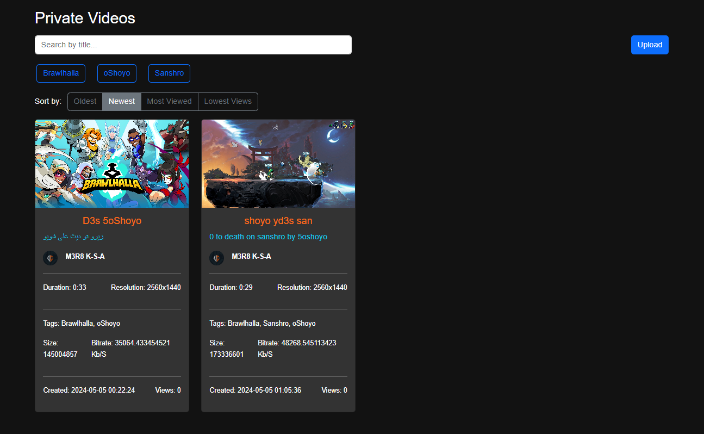

#### Watch Clips Page :

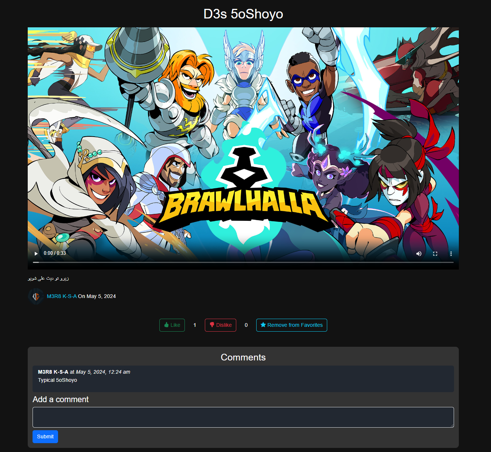

#### Image Gallery Page :

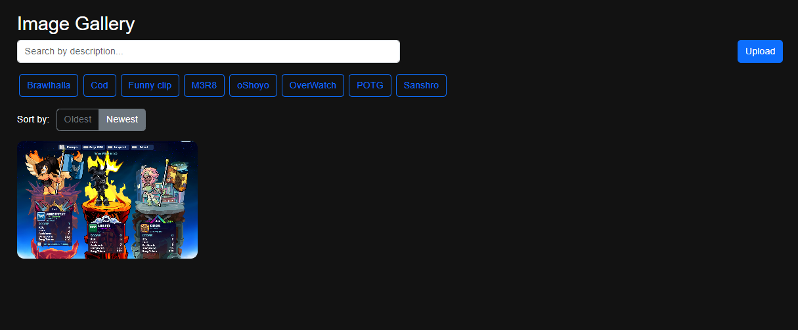

#### Image Gallery Page :

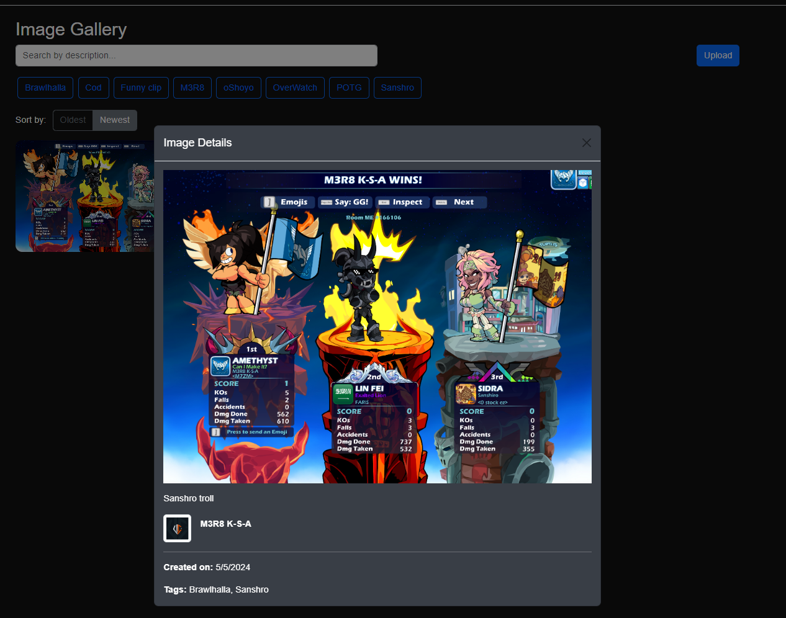

#### COD Page :

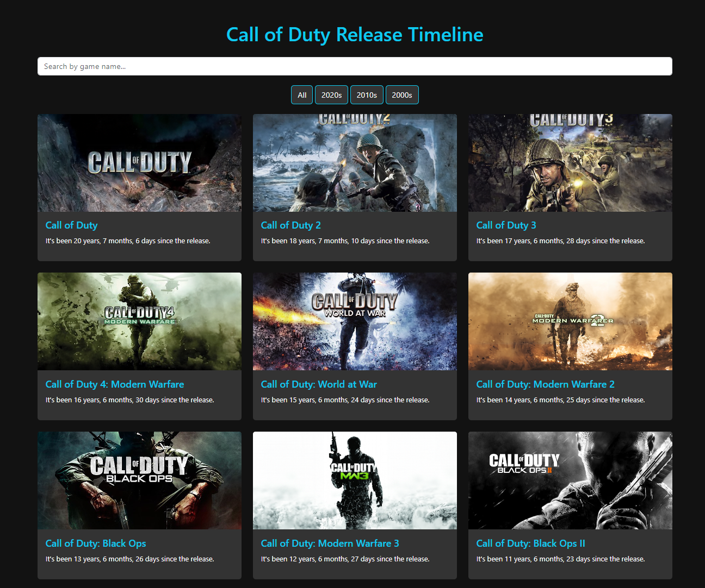

#### Game Reviews Page :

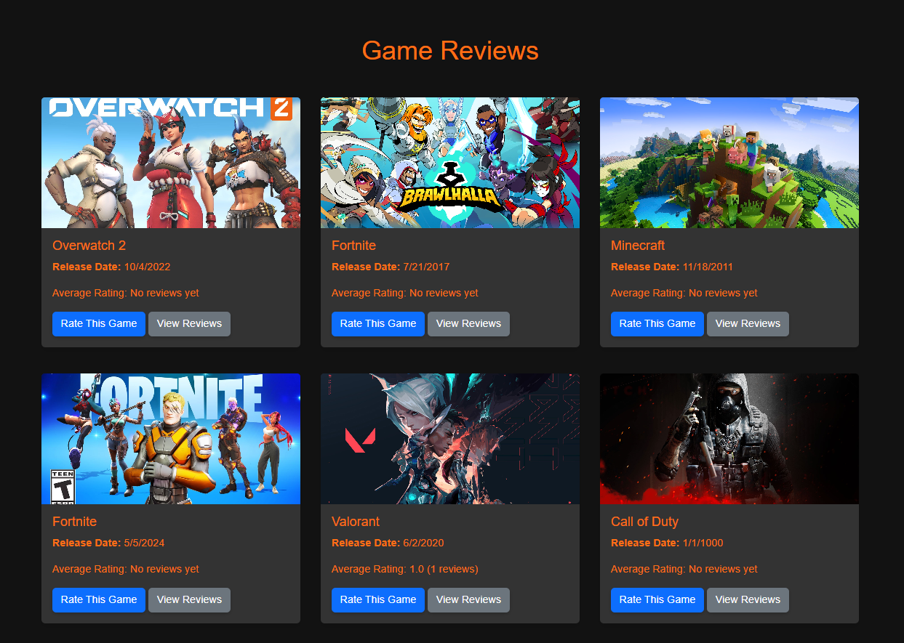

#### OW Custom Page :

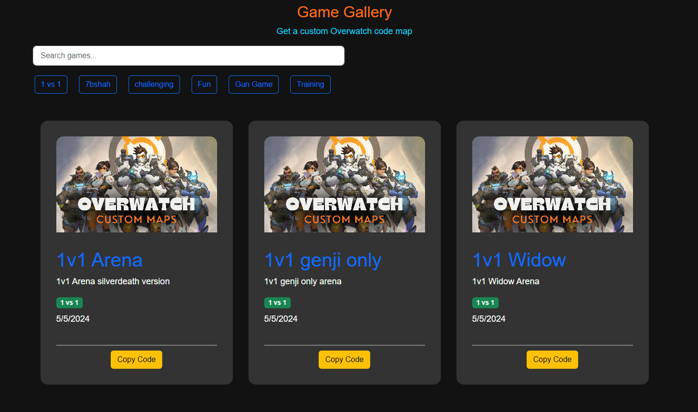

#### Translator Page :

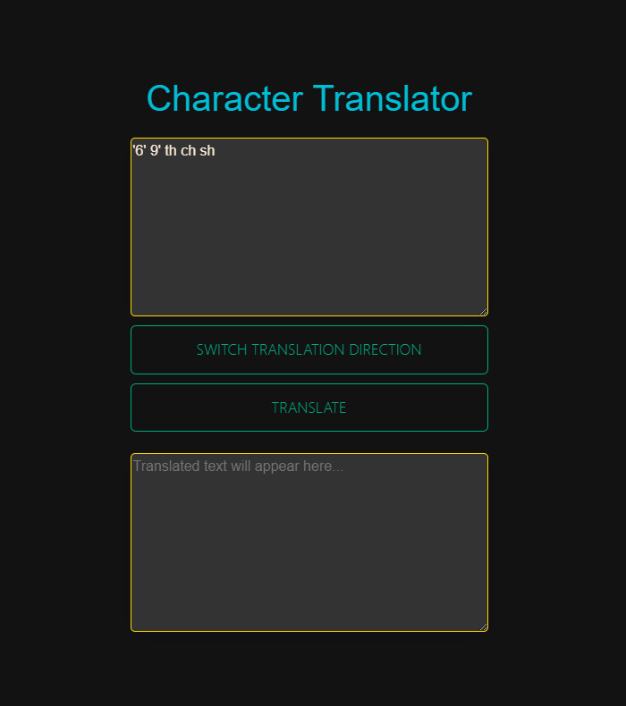

#### Account Page :

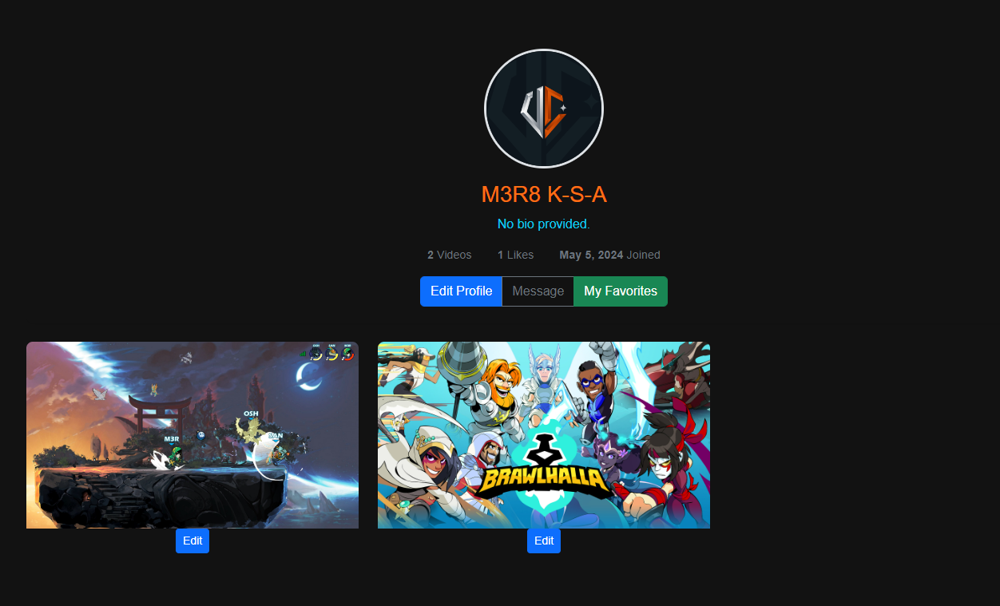

#### Edit Account Page :

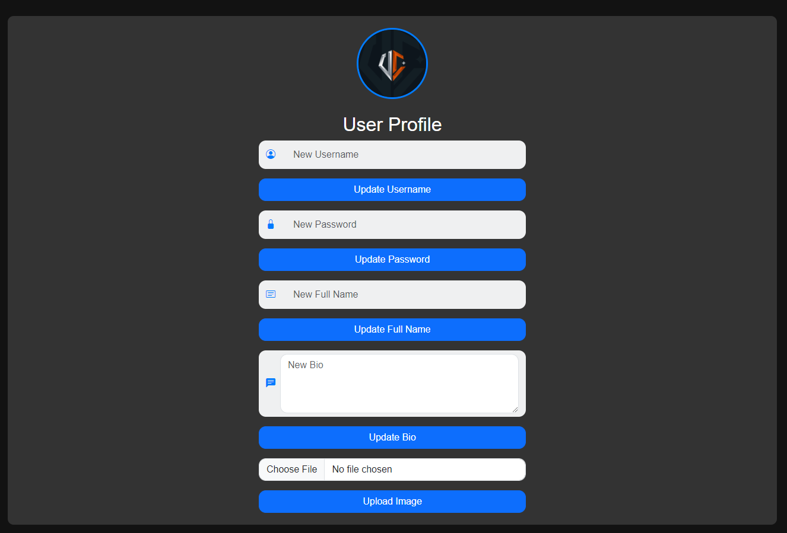

#### Search User Page :

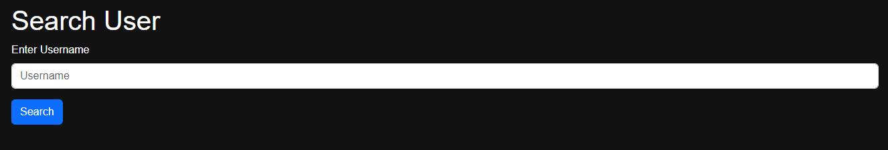

## Conclusion

The M7ZM Social Media Platform is a robust and secure environment for the M7ZM clan to share and enjoy gaming-related content. With features like video and image uploads, real-time chat, game reviews, and special functionalities for non-logged-in users, the platform offers a comprehensive solution for enhancing community interaction and engagement. We hope you enjoy using it and welcome any contributions to make it even better!

**I am not responsible for any misuse of this website. All credit for the source code goes to me.**
